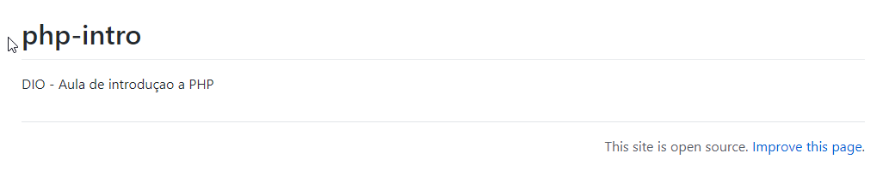

# 🕹 DIO - Aula de introduçao a PHP
> Criando em PHP - DIO

## 📋 Índice
- [Link do projeto:](https://finandolopes.github.io/php-intro/)

- [📖 Sobre](#-Sobre)
- [🚀 Tecnologias utilizadas](#-Tecnologias-utilizadas)
- [🖥 Preview](#-Preview)

## 📖 Sobre
 - Aula DIO - Introdução ao PHP

## 🚀 Tecnologias utilizadas
- `PHP`

## 🖥 Preview:

  

   

